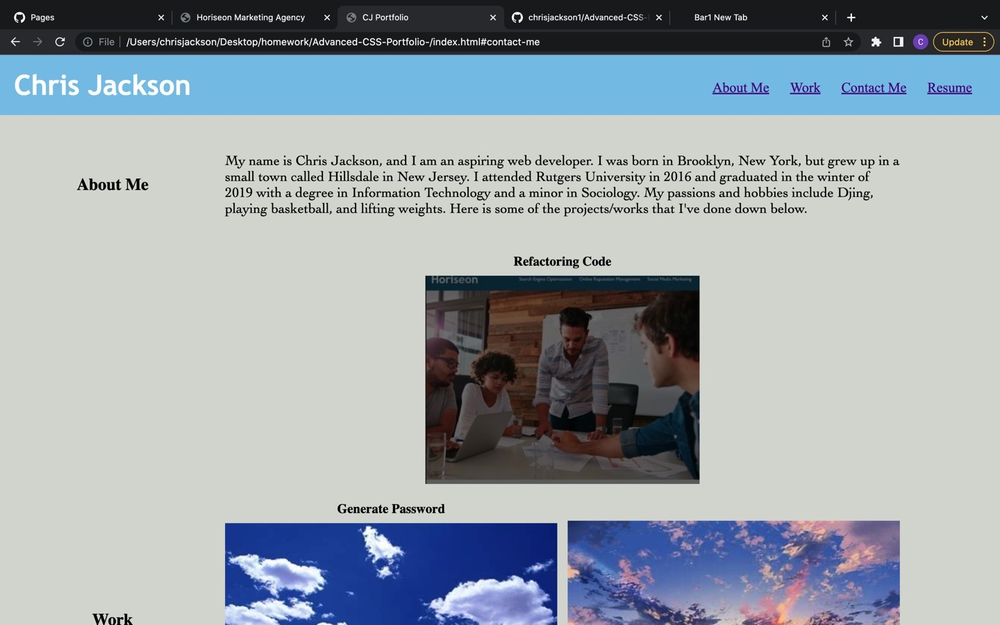

# Portfolio-
Building CSS Portfolio from Scratch

## Description

This portfolio demonstrates my learnings of CSS and HTML code and building a profile from scratch to show off to potential recruiters and employers to look at. Detailing things such as my name, profile picture, information about me, contact information, along with other assignments and projects that I've done show casing our skills.

Screenshot:

Link to Deployed Application

https://chrisjackson1.github.io/Advanced-CSS-Portfolio-/

https://family-cookbook-astokes.herokuapp.com/

